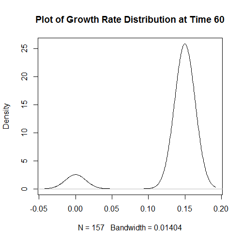
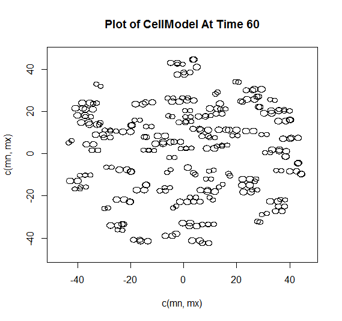
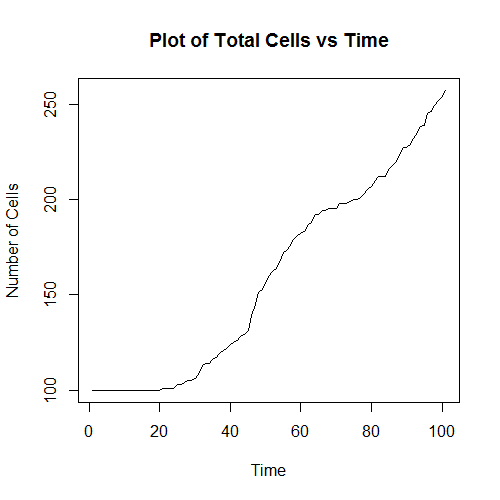

---
nocite: |
  @DRASDO20031163, @Fertig2014, @PhysRevE.52.6635, @Hill2016
...

11
This vignette summarizes the uses and formats of the provided functions. Most of this information is available throughout the R documentation provided. This is an appendix which brings together all the provided information, to one place.

##Introduction

Off-Lattice Cell-Based Monte Carlo (OCMC) is a simulation based off previous data that enables the modeling of cell growth. The OCMC package is implemented in C++, and compiled and integrated into R using the Rcpp package. 

##Installation

source("http://www.bioconductor.org/biocLite.R")

biocLite("CellModel")

##Getting Started

In this section, we will first describe the main function and its uses. Then we will describe the rest of the functions after the main model is created.

######runModel

The following function, "runModel" will be the main and most basic function that will be run in the usage of this package. Below is the syntax of the function, only requiring two of its many arguments in order to create a model. An example of the proper syntax is provided below:
```{r}
# Runs the Model
runModel <- function(initialNum, runTime, density = 0.05,
                    meanGrowth = 0.15, varGrowth = 0.0, maxMigration = 0.5,
                    maxDeform = 0.075, maxRotate = 0.3, epsilon = 0.05,
                    delta = 5.0, outIncrement = 10, randSeed = 0)
runModel(10,10)
```

Each argument will simulate a certain variable in cell growth:

* initialNum: the number of initial cells that will start in the model
* runTime: how long the model will run for
* density: the density the cells are seeded at
* meanGrowth: mean growth rate of cells
* varGrowth: the variance of the growth rate (assumed normal)
* maxMigration: farthest a cell can move in a single update
* maxDeform: most a cell can deform in a single update
* maxRotate: most a cell can rotate in a single update
* epsilon: model specific parameter
* delta: model specific parameter
* outIncrement: time increment to print status at
* randSeed: "randomness" seed for the model

Upon running this function, a CellModel object will be created, along with the printing of the time, and interval specified by "runTime" and "outIncrement" respectively.


Once this function is called and stored into a variable, the other functions can be used as there is no default "CellModel" object provided for the other functions.

##Additional Functions
Many of the functions that will be used to analyze the CellModel, can only be done so when one is created and will generally require only two arguments to be passed to it:

* mat: A CellModel object
* time: The Time of Interest

This is because analyzing the data created from the CellModel requires plotting an aspect of the cells to a point in time.

There is one exception as the "plotTotalCells" function is the only one that requires one argument, the "mat" argument.

######getDensity
This function allows the user to retrieve the density of the cells at any given time within the maximum time the model was allowed to run. The determining of the density of the cells at certain points, allows for the potential relationships of the cells to be determined at intervals, such as the attraction or repulsion of the cells due to high density or proximity to one another at intervals of 10 timesteps. 

```
# sample
library(CellModel)
data <- runModel(100,100)
getDensity(data,60)

# output
#[1] 0.06039155
```
Density of a cell population is important because when it reachesa certain critical value, factors such as cell growth rate and cellular division begin to slow down or become harmful to each cell. At certain points cells will die, however when there is not enough "room" cells are destroyed or become similar to a tumorous group of cells.

######plotGrowthRateDistribution
This function is a key in visualizing the growth rates of the CellModel as time increases or discerning it at certain time points. The visualization of growth rates is important as it allows for showing when the cell population is growing slower or faster at certain times. 

Generally in the model, a higher growth rates generally indicate more activity within the cell which can occur for many reasons, which needs to be modeled as it can influence other biological processes.



The graph above is an example of the output from the function. The x-axis is the range of growth rates that were developed in the model. The distribution curve is a normal curve based on the dataset at the time provided by the user. 

######plotCellsAtTime and plotInteractive
This function allows the user to visualize the cells by plotting each individual cell on a Cartesian Plane to view possible CellGrowth and movement of the cells. This will allow a user to see how the model is progressing at certain times or intervals.

The provision of visualizing a change in the graph at any point or at certain timepoints allows comparison between why certain aspects in the model happen. For example at certain timesteps it appears that the density is lower than expected. However the model shows the cells spreading out instead of the tight formation that could be examined in the first timestep.



Above is an example plot of the cell model at time 60. The axes for the entire plot, are in a simple Cartesian plan. It allows for a better designation of where the cells are and which are the ones of interest. Within the example, cells undergoing mitosis or cell division can be viewed, and can be easily seen properly undergoing the process.

In addition to the graphing portion, the function, "plotInteractive", calls upon "plotCellsAtTime", and allows for command-line-like arguments to be taken into it that enable it to be manually iterated through each timestep. The following are the current "commands" that can be inputted, along with their functionaility:

* summ = total amount of cells
    + d = density of the time
    + g = average growth rate at time
* b <t=1> = back "t" timestep(s)
* n <t=1> = forward "t" timestep(s)
* t <t> = set time of plot to "t"
* q = quit out of the function

The graph shown previously is the exact same for "plotInteractive" due to "plotCellsAtTime" being part of the function. However, the console-like commands enable the user to more easily change and create intervals at which to view the model. Additionally it provides a few summarizing features such as viewing the average growth rate of the model at the specified time or allowing for the density to be viewed without having to exit the function.

######plotTotalCells
This function is to plot the increasing amount of cells vs time. As more cells are created, the rate at which cells are created should also increase, and this will allow a visual representation of that.

Through the visualization the total cells over time, comparisons can be made between the density and growth rates which are received from other functions at the respective time. 




##Feedback

Please send any feedback to tsherma4@jhu.edu or ejfertig@jhmi.edu

##Acknowledgements

## References
