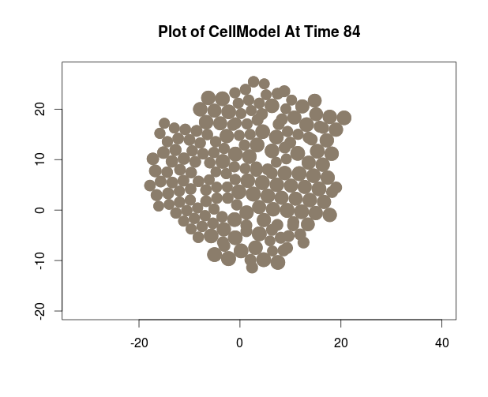

```{r include=FALSE, cache=FALSE}
library(CancerInSilico)
## I left this in so that it can be built in Rstudio. I will take it out
## before submission.
```

# Introduction

The main objective of the *CancerInSilico* package is to provide an R interface for running mathematical models of tumor progression. In C++, we have implemented an off-lattice, cell-based model from @DRASDO2003 and this package provides the neccesary R functions to run the C++ code and analyze the output in R. In general, cell-based models simulate each cell in a tumor, accounting for interactions with its neighbors and its local environment. This model specifically models cell-cycle, intercellular forces, and cellular motility. By doing so, it places focus on the cell-cell dynamics which allows for a detailed exploration of intra- and inter-cellular mechanisms that effect overall population dynamics of cells in a tumor. 

We note that the mathematical model from @DRASDO2003 is one of a larger class of cell-based models of tumor progression [see @SZABO2013 review]. With this in mind, we have developed the package *CancerInSilico* so that additional types of cell-based models can be easily integrated. Future versions of the package will focus on expanding the types of models available to the user.

# *runCancerSim*: Main function to simulate tumor progression

The *runCancerSim* function provides a centralized R interface to run c++ code for cell-based models of tumor progression, released with this package. The following code provides an example of running *CancerInSilico* to simulate clonal outgrowth from a single cell with the @DRASDO2003 model over 84 hours using the central model simulation function *runCancerSim*.

```{r,eval=FALSE}
single_cell_run <- runCancerSim(initialNum = 1, runTime = 84)
                                
```

```{r,eval=F}
plotCellsAtTime(single_cell_run, 84)
```


*Figure 1* the distribution of cells from this simulation at the final 84 hour time point using the plotting function *PlotCellsAtTime*, described further in Section 2.3.5.

## *runCancerSim* Usage

```{r, eval=F}
runCancerSim(initialNum, runTime, density = 0.1, cycleLengthDist = 12,
             inheritGrowth = F, outputIncrement = 6, randSeed = 0,
             modelType = "DrasdoHohme2003", ...)
```

## Parameters

### Parameter Overview

*initialNum* - [integer] required parameter, must be greater than zero  
*runTime* - [double] required parameter, must be greater than zero  
*density* - [double; default = 0.1] optional parameter, must be in the range (0,0.1)  
*cycleLengthDist* - [array of doubles; default = 12] optional parameter, all values must be greater than 2  
*inheritGrowth* - [bool; default = FALSE] optional parameter  
*outputIncrement* - [double; default = 6.0] optional parameter, must be greater than 0.1  
*randSeed* - [double; default = 0.0] optional parameter  
*modelType* - [string; default="DrasdoHohme2003"] optional parameter

### Parameter Desciption

*initialNum*

The number of cells in the model at time zero. A value of 1 simulates growth from a single cell.

*runTime*

The number of (model) hours to run the simulation for. For an explanation of the time scale in the model, see the description for *cycleLengthDist*.

*density*

The cells are initially seeded randomly throughout a circle, whose radius is calculated based on the density parameter. *density* in this case is defined as the ratio of the total area of the cells and the area of the circle. Providing a *density* higher than 0.1 will result in an error, since the program cannot efficiently seed cells that close together.

*cycleLengthDist*

The model does not have a length scale so the dimensions of the cells are arbitrary, but it does have a time scale - set by this parameter. The value passed in *cycleLengthDist* is the average length (in terms of simulation hours) of the cell-cycle for a cell in isolation. If a vector is passed in *cycleLengthDist* then it is treated as a distribution of times and each cell is assigned a random value (uniform) from this vector when it is born. Cells are initially seeded at random points within the cell-cycle.

*inheritGrowth*

Cells have the option of inheriting the cycle-length from their parent or sampling from *cycleLengthDist* when they are born. This allows for "growth" rates to be affected in a heritable way (i.e. simulate a mutation by setting a small proportion of cycle-lengths to be extremely short and set *inheritGrowth* to TRUE)

*outputIncrement*

The amount of (model) hours in between each display during the run.

*randSeed*

The user can pass in a random seed of their choosing. All random samples in the model will be affected by this seed. The default seed is 0.

*modelType*

String indicating which cell-based model is run. By default, it is set to "DrasdoHohme2003" to simulate cells with the c++ code for the @DRASDO2003 implemented in the src directory. 

### @DRASDO2003 Specific Parameters

*epsilon* - [double; default = 10.0] optional parameter, must be greater than zero  
*nG* - [double; defualt = 24.0] optional parameter, must be greater than one

In the @DRASDO2003 model, cells primarily do two things: move and grow. When a cell grows to twice its original volume, it divides. This process happens at a rate depending on what the user sets *cycleLengthDist* to be. Cells move in order to arrange themselves to respect the intercellular forces mentioned in the introduction. High values for *epsilon* make it less likely for cells to move against the intercelluar forces. High values for *nG* give the model more time in between growth steps to find the ideal configuration based on the present intercellular forces. These parameters are described in more detail in @DRASDO2003

## Output Variables and *CellModel* class 

The output of the model is stored in a *CellModel* object. This object has two fields: *cells* and *parameters*. *parameters* contains a named list of all the parameters used to run the model. *cells* is a list that contains information about the cell population at every time step in the model. The primary purpose of this object is to store all the information about a run in a single place and provide a standard data structure for the package functions to handle the raw data safely.

```{r}
# the result of runCancerSim stored in
# basic_sim are a CellModel object
basic_sim <- runCancerSim(initialNum = 30,
                          runTime = 24,
                          density = 0.05,
                          cycleLengthDist = 10 + rexp(1000,1/4),
                          inheritGrowth = FALSE,
                          outputIncrement = 6,
                          randSeed = 10,
                          epsilon = 10,
                          nG = 6)
```

## Functions for analysis of *CellModel* class

The following describes several functions used to get relevant information from the *CellModel* object in a user-friendly format, without requiring direct interaction with the complex fields from raw data stored in the *CellModel* class.

### *getParameters*

This is the function used to get any information about the parameters passed into the model.

**Function Signature**: 

```{r,eval=FALSE}
getParameters(model, fullDist = FALSE)
```

**Arguments**:

*model* - A *CellModel* object  
*fullDist* - TRUE/FALSE

**Return**:

returns a named list containing the parameters for *model*. If *fullDist* is TRUE it returns the entire vector for *cycleLengthDist*, otherwise it just returns the mean.

**Example**:

```{r}
## example call
getParameters(basic_sim) 
```

In order to see the full distribution that was passed in, it is neccesary to specifiy:

```{r}
d <- getParameters(basic_sim, fullDist=TRUE)$cycleLengthDist
plot(density(d),main="Cycle Length Distribution - Parameter",xlab="length")
```

### *getNumberOfCells*

**Function Signature**: 

```{r,eval=FALSE}
getNumberOfCells(model, time)
```

**Arguments**:

*model* - A *CellModel* object  
*time* - A double between 0 and the *runTime* in *model*

**Return**:

The number of cells in *model* at *time*.

**Example**: 

```{r}
length <- getParameters(basic_sim)$runTime
t <- sapply(0:length,getNumberOfCells,model=basic_sim)
plot(0:length, t, type = "l", xlab="time", ylab="# of cells")
```

### *getCycleLengthDistribution*

**Function Signature**: 

```{r,eval=FALSE}
getCycleLengthDistribution(model, time)
```

**Arguments**:

*model* - A *CellModel* object  
*time* - A double between 0 and the *runTime* in *model*

**Return**:

A vector of cell-cycle lengths for each cell in *model* at *time*.

**Example**: 

```{r}
cyc_len <- getCycleLengthDistribution(basic_sim,0)
plot(density(cyc_len),main="Cycle Length Distribution - Time 0",xlab="length")
```

### *getDensity*

**Function Signature**: 

```{r,eval=FALSE}
getDensity(model, time)
```

**Arguments**:

*model* - A *CellModel* object  
*time* - A double between 0 and the *runTime* in *model*

**Return**:

The density of cells in *model* at *time*

**Example**: 

```{r}
den <- sapply(0:length,getDensity,model=basic_sim)
plot(0:length,den,type="l",xlab="time",ylab="cell density")
```

### *plotCellsAtTime*

**Function Signature**: 

```{r,eval=FALSE}
plotCellsAtTime(model, time)
```

**Arguments**:

*model* - A *CellModel* object  
*time* - A double between 0 and the *runTime* in *model*

**Return**:

plots a visual representation of the cells at *time*.

**Example**: 

```{r}
plotCellsAtTime(basic_sim,0)
plotCellsAtTime(basic_sim,length)
```

### *plotInteractive*

The *plotInteractive* function is similiar to *plotCellsAtTime* except there are additional commands that allow the user to step through the simulation and watch it progress as well as display information at the current timestep.

**Function Signature**: 

```{r,eval=FALSE}
plotInteractive(model, time = 0)
```

**Arguments**:

*model* - A *CellModel* object  
*time* - A double between 0 and the *runTime* in *model*

**Return**:

Calls *plotCellsAtTime*(*model*,*time*). From there the user can input one of the following commands to step through the simulation and observe how the cells change over time.

```
Basic Commands:
b ARG = back ARG timesteps (default ARG = 1)
n ARG = forward ARG timesteps (default ARG = 1)
t ARG - jump to timestep ARG (default ARG = 1)
s = summary of cells
q = quit "console"
h = basic command help
```

## References